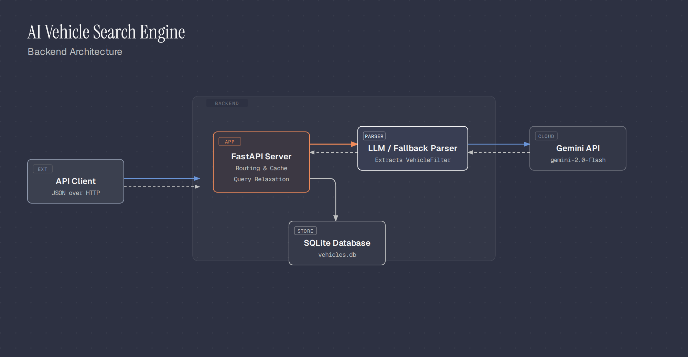
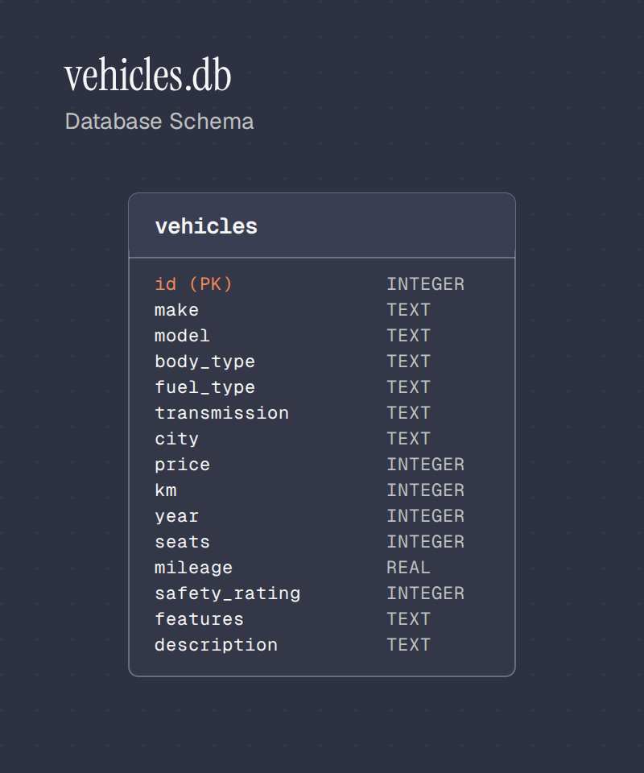

# Design Document: AI Vehicle Search Engine



This document outlines the core architectural choices and design principles behind the AI Vehicle Search Engine. The primary goal is to provide a robust, injection-safe, and gracefully degrading search experience over a vehicle catalogue.

---

## Core Design Principles

### 1. Why the LLM never writes SQL

```
sentence -> parser (LLM or regex fallback) -> VehicleFilter -> validate/clamp -> parameterized SQL -> results
```

The system strictly decouples natural language understanding from database querying. `app/sql_builder.py` is the **only module** in the codebase that produces SQL text, and every value it places into a query arrives as a bound `?` parameter—including all data extracted by the model.

This approach provides three major benefits:
- **No SQL Injection Surface:** The model's output never becomes part of the raw SQL string, entirely eliminating the need to sanitize or escape LLM outputs.
- **No Hallucinated Vehicles:** Every row returned in a response comes from a real `SELECT` against the database. The model may misunderstand a sentence, but it cannot invent a car that doesn't exist.
- **High Testability:** Both `app/fallback_parser.py` and `app/llm_parser.py` produce the exact same `VehicleFilter` type. This allows `tests/eval.py` to assert the *understanding* of a sentence without requiring a live model or a running server.

### 2. Why SQLite over MongoDB/Postgres

The system is designed for simplicity and ease of use in a hackathon/demo environment. A user runs one command (`python -m scripts.seed`) and immediately gets a fully functional database.



There is no need for Docker, daemon processes, or complex connection strings. At ~450 rows, the entire catalogue fits comfortably in a single `SELECT ... WHERE ... LIMIT` query, meaning there is no performance justification for a heavier database engine.

**When to scale:** This architecture is sufficient until the system requires:
- Multiple concurrent writers (SQLite's single-writer model would struggle).
- A catalogue exceeding roughly 100k-1M rows where index-less `LIKE` scans impact latency.
- Managed replication and backups.

### 3. The Deliberate Absence of Vector Embeddings

While "fuzzy concept" and "vague intent" queries often suggest semantic search, the scale of this project (450 rows, fixed schema) allows for cheaper, deterministic mechanisms:
- **Fuzzy concepts** ("family car", "high safety") map to a **fixed, small vocabulary**. `app/concepts.py` acts as a direct lookup table, completely bypassing the need for similarity search.
- **Vague intent** ("something reliable for city commuting") degrades gracefully to a standard `LIKE` scan over the `description` field. This is highly effective for a curated catalogue built from template text.

A vector store would introduce an external dependency, require an index-build step, and create a new failure mode (embedding model unavailability) for a problem this dataset does not have.

### 4. The Fallback Strategy

The application includes an offline fallback parser (`app/fallback_parser.py`) for two key reasons:
1. **High Availability:** If `GEMINI_API_KEY` is unset, rate-limited, or the network drops during a demo, `/search` continues to serve results instead of throwing 500 errors. (Append `?no_llm=true` to force this path for demonstration purposes).
2. **A Correctness Oracle:** `app/concepts.py` is consumed by both the fallback parser directly and the LLM via its system prompt. Evaluating both paths against the same test suite ensures that concept definitions remain consistent across both execution methods.

### 5. Smart Relaxation Strategy

To prevent frustrating empty result sets, `app/relaxation.py` incrementally widens or drops constraints in a fixed, logical order. The cheapest concessions are made first:

1. Widen `price_max` by 25% (budgets are usually soft ceilings).
2. Drop `km_max` ("low km" is a preference, not a strict requirement).
3. Drop `safety_rating_min` (typically derived from fuzzy concepts).
4. Drop `seats_min`.
5. Drop `transmission` (cross-transmission equivalents exist).
6. Drop `fuel_type`.
7. Drop `body_type`.
8. Drop `keywords` (free text is less strict than named entities).
9. Drop `features_any`.
10. Drop `make` / `model` / `city` / `color` (Identity is dropped last, as it fundamentally changes the requested entity).

Every executed relaxation step is documented in plain English within the `relaxed` response field, providing full transparency to the client.

---

## Known Limitations

- **Comparative Queries:** Queries like "cheaper than a Creta" are not supported, as there is no mechanism to resolve a specific listing's price dynamically into a bound for a filter.
- **Multi-turn Context:** The service is entirely stateless. Follow-up queries (e.g., "what about in blue?") lack context of the prior query.
- **Negation Parsing:** Phrases like "not white" or "no CNG" are not natively parsed. Both the concept table and the regex parser operate on additive logic only.
- **Ambiguous Makes/Models:** Some vehicle models share names with common English words (Honda **City**, Tata **Punch**, Jeep **Compass**). The fallback parser strictly requires the manufacturer name to be present to identify these models. Thus, "city commuting" triggers vague-intent search, but "punch it" will not recognize the Tata Punch.
- **Colloquial "Mileage" Overload:** In Indian usage, "mileage" can mean either "distance driven" or "fuel economy". `app/concepts.py` specifically maps explicit phrasing ("less driven" -> `km_max`, "fuel efficient" -> `mileage_min`) to avoid ambiguity.
- **EV "Mileage" Storage:** Electric vehicle efficiency is stored as a normalized score within the same column used for Internal Combustion Engine (ICE) `kmpl` to ensure `fuel_efficient` concepts map correctly. This is not a literal `kmpl` metric.